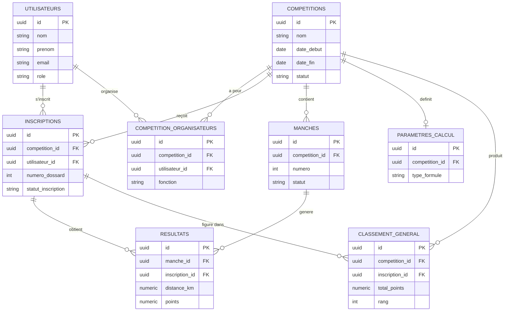

# Base de données - PPS-COMP-2027

Structure de la base de données pour la plateforme de gestion de compétitions de parapente.

## Fichiers

- `schema.sql` : script de création des tables (PostgreSQL)

## Aperçu des tables

| Table | Rôle |
|---|---|
| `utilisateurs` | Comptes (pilotes, organisateurs, juges, admin) |
| `competitions` | Une compétition organisée (dates, lieu, statut) |
| `competition_organisateurs` | Lien entre une compétition et son équipe d'organisation |
| `parametres_calcul` | Règles et coefficients de calcul des scores, par compétition |
| `inscriptions` | Inscription d'un pilote à une compétition (dossard, catégorie, statut) |
| `manches` | Les épreuves/manches d'une compétition |
| `resultats` | Résultat d'un pilote sur une manche (distance, vitesse, points) |
| `classement_general` | Classement cumulé, recalculé après chaque manche validée |

## Diagramme entité-relation

## Notes

- Le champ `parametres_json` de `parametres_calcul` permet de stocker des réglages spécifiques à une formule de calcul (ex. type GAP de la FAI) sans modifier le schéma.
- `classement_general` est une table de "cache" : elle est recalculée par le backend après chaque validation de résultats, plutôt que calculée à la volée à chaque requête.
