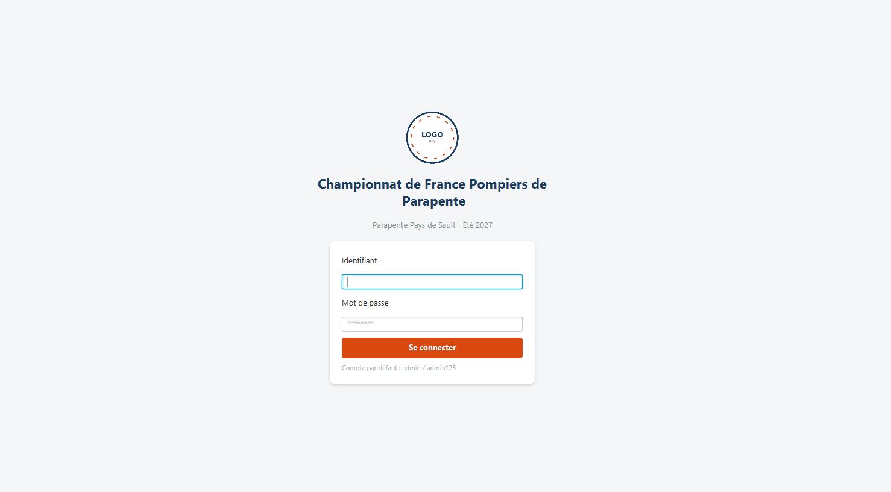
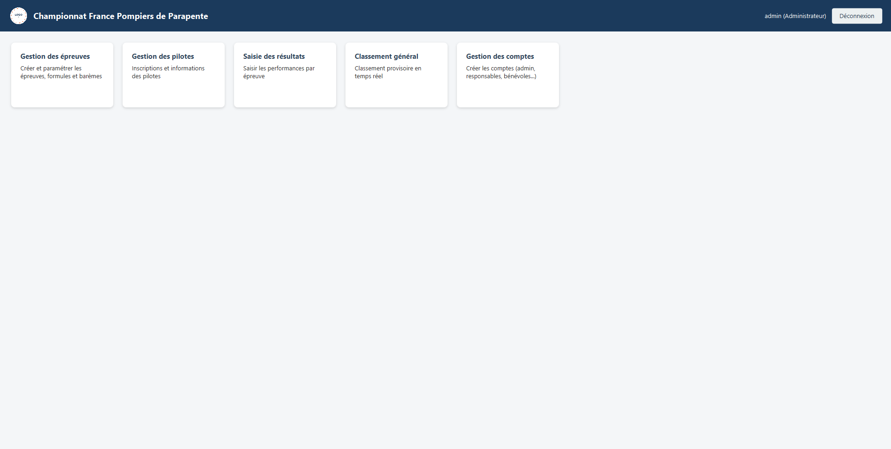
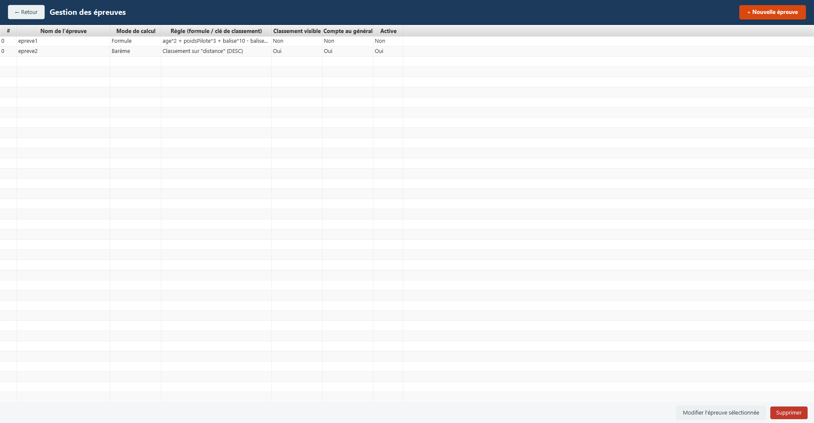
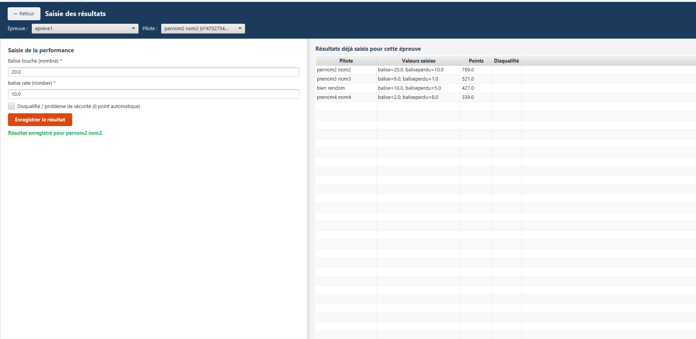
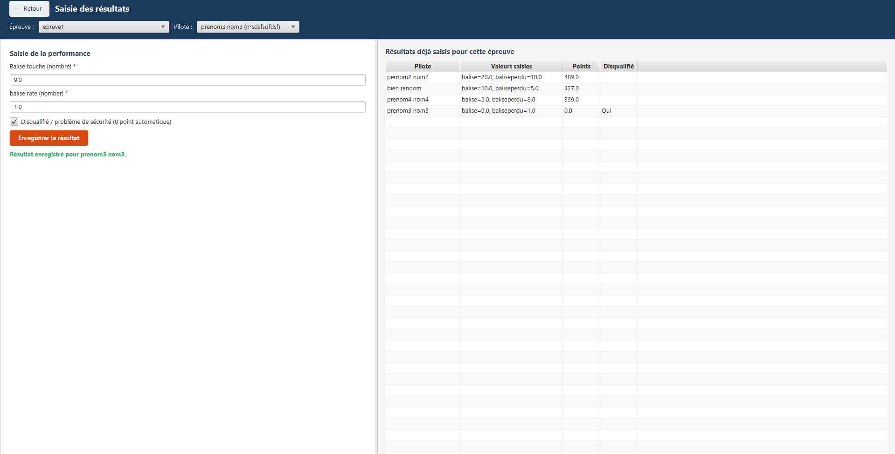
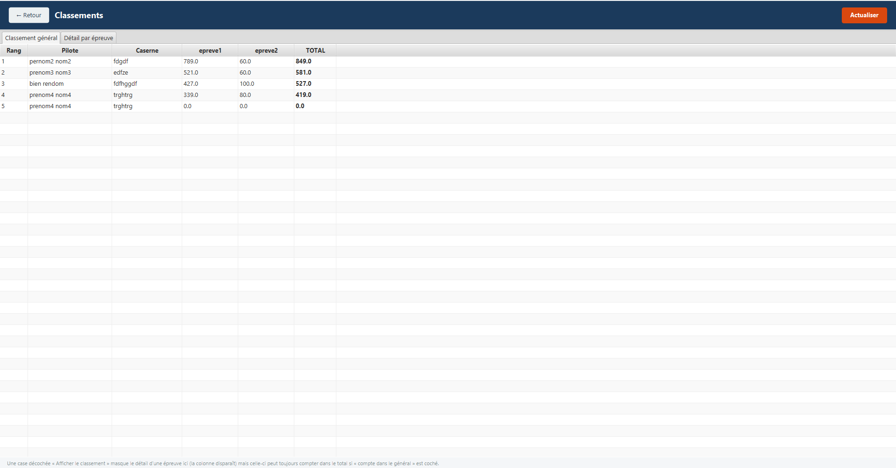
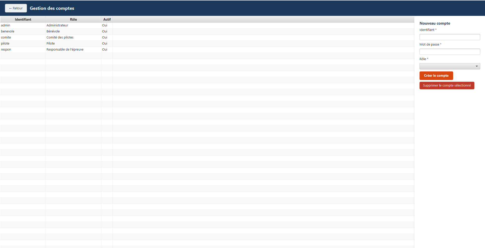

# Documentation Utilisateur (fr) v1  version PC .md

## Sommaire

- [1. Présentation générale](#1-présentation-générale)
- [2. Connexion et rôles](#2-connexion-et-rôles)
- [3. Tableau de bord](#3-tableau-de-bord)
- [4. Gestion des pilotes](#4-gestion-des-pilotes)
- [5. Gestion des épreuves](#5-gestion-des-épreuves)
- [6. Saisie des résultats](#6-saisie-des-résultats)
- [7. Classements](#7-classements)
- [8. Gestion des comptes](#8-gestion-des-comptes-administrateur)
- [9. Stockage des données et sauvegarde](#9-stockage-des-données-et-sauvegarde)
- [10. Questions fréquentes](#10-questions-fréquentes)

---

## 1. Présentation générale

L'application remplace les feuilles papier et fichiers Excel utilisés jusqu'ici pour
organiser le championnat. Elle permet :

- d'inscrire les pilotes,
- de créer librement les épreuves du championnat (la liste n'est jamais figée : c'est
  le club qui décide du nombre d'épreuves, de leur nom, et de la façon dont les points
  sont calculés),
- de saisir les résultats au fur et à mesure des épreuves,
- de consulter un **classement provisoire en temps réel**, aussi bien général que par épreuve.

Toutes les données sont stockées en local et sur internet.

---

## 2. Connexion et rôles

Au démarrage, l'application affiche un écran de connexion.



Chaque compte a un **rôle**, qui détermine ce qu'il peut faire dans l'application :

| Rôle | Peut faire |
|---|---|
| **Administrateur** | Tout, y compris créer les comptes des autres utilisateurs |
| **Responsable de l'épreuve** | Créer/modifier les épreuves, gérer les pilotes, saisir des résultats, consulter les classements |
| **Bénévole** | Saisir des résultats, consulter les classements |
| **Pilote** | Consulter les classements uniquement |
| **Comité des pilotes** | Consulter les classements uniquement |

Un compte administrateur existe par défaut à la première installation
Pensez à créer vos propres comptes puis, si besoin, à désactiver le compte par défaut.

---

## 3. Tableau de bord

Après connexion, le tableau de bord affiche uniquement les fonctionnalités auxquelles
votre rôle donne accès, sous forme de cartes cliquables.



---

## 4. Gestion des pilotes

Cet écran sert à inscrire les pilotes au championnat.


**Informations demandées à l'inscription :**

- Numéro de licence (obligatoire, unique — sert d'assurance/identifiant fédéral)
- Nom, prénom (obligatoires)
- Caserne
- Poids
- Email
- Année de naissance
- Catégorie (Espoir, Senior, Vétéran, Féminine — modifiable librement)

**Utilisation :**

1. Remplissez le formulaire à droite, cliquez sur **Ajouter**.
2. Pour modifier un pilote : cliquez sur sa ligne dans le tableau (le formulaire se
   remplit automatiquement), modifiez les champs, cliquez sur **Modifier**.
3. Pour supprimer un pilote : sélectionnez-le puis cliquez sur **Supprimer**
   (⚠️ cela supprime aussi tous ses résultats déjà saisis).

> Dès qu'un pilote est ajouté, il est automatiquement inscrit à toutes les épreuves déjà
> actives. Il devra donc les passer — s'il ne se présente pas à une épreuve, il aura
> automatiquement 0 point à celle-ci dans le classement général.

---

## 5. Gestion des épreuves

C'est le cœur de l'application : **aucune épreuve n'est prédéfinie**. Le club crée
librement chaque épreuve du championnat (atterrissage de précision, marche & vol,
cross, checkpoint... ou toute autre épreuve imaginée par le club), avec ses propres
règles de calcul des points.



Cliquez sur **+ Nouvelle épreuve** pour ouvrir le formulaire de création :


### 5.1 Informations générales

- **Nom** et **description** de l'épreuve.

### 5.2 Variables saisissables

Définissez librement les valeurs qui devront être mesurées/saisies pour cette épreuve
(ex: `temps`, `nbrBalises`, `poidsSac`, `distance`...). Chaque variable a :
- un **nom technique** (sans espace, utilisé ensuite dans le calcul),
- un **libellé** affiché lors de la saisie,
- une **unité** (facultative, pour l'affichage).

### 5.3 Mode de calcul des points

Deux modes possibles, au choix :

**a) Formule mathématique**


Vous écrivez directement une formule utilisant les variables définies ci-dessus, par exemple :

```
100 - temps*2 + nbrBalises*10 - poidsSac*0.5
```

Deux variables sont automatiquement disponibles en plus, sans avoir besoin de les
saisir : `age` et `poidsPilote` (venant de la fiche du pilote).

**b) Barème par classement**


Les pilotes sont classés selon une variable clé de votre choix (ex: `temps` ou
`distance`), dans le sens que vous précisez (la plus petite valeur gagne, ou la plus
grande), puis les points sont attribués selon un tableau "rang → points" que vous
définissez (ex: 1er = 100 pts, 2e = 90 pts, 3e = 80 pts...). Au-delà du dernier rang
défini, les points du dernier palier sont automatiquement reconduits pour tout le monde.

> 💡 Le barème se recalcule automatiquement pour **tous** les pilotes de l'épreuve à
> chaque nouvelle saisie, puisque les rangs sont relatifs les uns aux autres.

### 5.4 Options de l'épreuve

- **Afficher le classement** : rend le détail de cette épreuve consultable et affiche sa colonne dans le classement général.
- **Compte dans le classement général** : les points de cette épreuve sont additionnés
  au total du championnat.
- **Active** : l'épreuve apparaît (ou non) dans l'écran de saisie des résultats.

---

## 6. Saisie des résultats





1. Choisissez l'**épreuve** concernée dans la liste déroulante.
2. Choisissez le **pilote** (seuls les pilotes inscrits à cette épreuve apparaissent).
3. Le formulaire de saisie s'adapte **automatiquement** : il affiche un champ pour
   chaque variable définie pour cette épreuve (voir [section 5.2](#52-variables-saisissables)).
4. Renseignez les valeurs mesurées.
5. Si le pilote doit être disqualifié (problème de sécurité, etc.), cochez la case
   correspondante : il obtient automatiquement 0 point.
6. Cliquez sur **Enregistrer le résultat**.

Le tableau à droite liste tous les résultats déjà saisis pour l'épreuve sélectionnée,
avec les points calculés en direct.

---

## 7. Classements

### 7.1 Classement général



Affiche, pour chaque pilote : son rang, ses points sur chaque épreuve comptant dans le
classement général, et son total. Cliquez sur **Actualiser** pour recalculer après de
nouvelles saisies.

> Un pilote inscrit à une épreuve mais sans résultat saisi obtient automatiquement
> 0 point à cette épreuve (règle du club : toute personne inscrite doit passer les
> épreuves).

### 7.2 Détail par épreuve


Cet onglet permet de consulter le classement complet d'**une seule épreuve**, avec le
détail des valeurs saisies pour chaque pilote. Seules les épreuves dont l'option
**"Afficher le classement"** est cochée apparaissent dans la liste déroulante.

Cet écran est accessible à **tous les rôles**, y compris les Pilotes et le Comité des
pilotes.

---

## 8. Gestion des comptes (Administrateur)



Réservé au rôle Administrateur. Permet de créer un compte pour chaque personne
impliquée dans l'organisation (responsable d'épreuve, bénévoles...), en choisissant son
identifiant, son mot de passe et son rôle.

---

## 9. Stockage des données et sauvegarde

Toutes les données (pilotes, épreuves, résultats, comptes) sont stockées **localement**,
dans un dossier `data/` situé à côté de l'application. Aucune connexion internet n'est
nécessaire pour utiliser l'application au quotidien.

⚠️ **Pensez à sauvegarder régulièrement ce dossier `data/`** (copie sur clé USB, disque
externe...), notamment avant et pendant l'événement, afin de ne jamais perdre les
résultats du championnat.

---

## 10. Questions fréquentes

**J'ai créé une épreuve mais un pilote n'apparaît pas dans la liste au moment de la
saisie des résultats.**
Vérifiez qu'il a bien été inscrit après la création de l'épreuve (l'inscription se fait
normalement automatiquement) et que l'épreuve est bien marquée comme "Active".

**Le classement d'une épreuve n'apparaît pas dans l'onglet "Détail par épreuve".**
Vérifiez que l'option **"Afficher le classement"** est bien cochée pour cette épreuve.

**J'ai modifié le nom d'une épreuve, dois-je ressaisir les résultats ?**
Non, les résultats sont conservés, seul le nom affiché change.

**Un message d'erreur apparaît, que faire ?**
Les messages affichés sont volontairement rédigés en français simple. S'ils persistent,
contactez la personne en charge technique de l'application.
